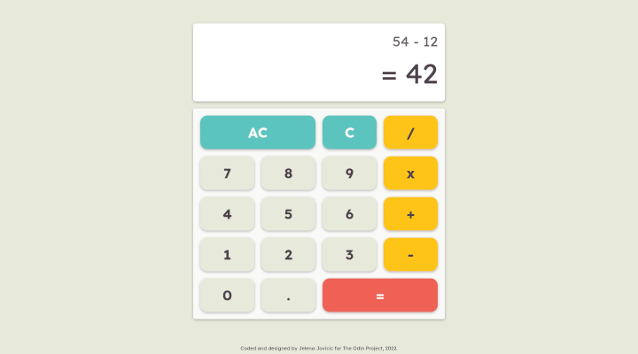

# calculator
# The Odin Project - Calculator

Simple on-screen calculator using JavaScript, HTML, and CSS. Built for [The Odin Project](https://www.theodinproject.com).

## Table of contents

- [Overview](#overview)
  - [Description](#description)
  - [Screenshot](#screenshot)
  - [Links](#links)
- [My process](#my-process)
  - [Built with](#built-with)
  - [The process](#the-process)
  - [Useful resources](#useful-resources)
- [Author](#author)

## Overview

### Description

This is a simple calculator that performs basic math operations on a pair of numbers.

### Screenshot

### Links

- [Solution](https://github.com/je-jo/calculator)
- [Live Site](https://je-jo.github.io/calculator/)

## My process

### Built with

- Semantic HTML5 markup
- CSS custom properties
- CSS Grid
- Mobile-first workflow
- Javascript

### The process

As we've been warned, getting useful variables from user input, was the hardest part of this project. My solution is to store a single number by building a string from the input, than turn that string to number as a second argument for calculations, when clicking an operator button. The first argument is a previous result, or a 0.

- [x] Create functions for basic math calculations;
- [x] Create operate() function that calls a calculation function;
- [x] Create basic html calculator with display, digits, operators and "clear" buttons;
- [x] Create function to populate display when clicking on numbers;
- [x] Make calculator work: store input numbers and operator, perform calculations and update display with result;
- [x] Add ability to string together several operations;
- [x] Round results with long decimals;
- [x] Display error message on division by zero;
- [x] Extra credit: Add "." button;
- [x] Extra credit: Add "backspace" button;
- [] Extra credit: Make calculator pretty;
- [] Extra credit: Add keyboard support;

### Useful resources

- [Minireset](https://awesomeopensource.com/project/jgthms/minireset.css?categoryPage=29) - A tiny modern CSS reset. 
- [Box Shadows](https://box-shadow.dev/) A fun and useful tool for playing around with box shadows.

## Author

- [Github](https://github.com/je-jo)
- [Frontend Mentor](https://www.frontendmentor.io/profile/je-jo)
- [Codepen](https://codepen.io/je-jo)
- [Twitter](https://twitter.com/jelena_jo_)
